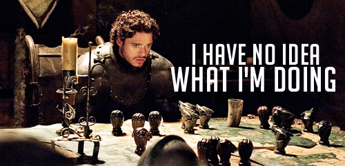

<!--lint disable no-repeat-punctuation match-punctuation awesome-heading awesome-github awesome-git-repo-age-->

  
   
  

> Board games are played on a tabletop, often employ combinations of strategy, skill, and luck, and are a great way to pass the time with friends and loved ones.

## Contents

- [Family](#family)
- [Strategy](#strategy)
- [Party](#party)
- [Contribute](#contribute)

## Family

### [Ghost Blitz](https://boardgamegeek.com/boardgame/83195/ghost-blitz)

> Balduin, the house ghost, found an old camera in the castle cellar. Immediately he photographed everything that he loves to make disappear when he is haunting  – including himself, of course. Unfortunately, the enchanted camera takes many photos in the wrong colors. Sometimes the green bottle is white, at other times it's blue. Looking at the photos, Balduin doesn't really remember any more what he wanted to make disappear next. Can you help him with his haunting and quickly name the right item, or even make it disappear by yourself? If you grab the right items quickly, you have a good chance of winning...

| Players | Min. Age | Time |
| ------: | -------: | ---: |
|   2 - 8 |        8 |  20m |

### [Ticket to Ride](https://wikipedia.org/wiki/Ticket_to_Ride_(board_game))

> ...a cross-country train adventure where players collect cards of various types of train cars that enable them to claim railway routes connecting cities in various countries around the world.

| Players | Min. Age |   Time |
| ------: | -------: | -----: |
|   2 - 5 |        8 | 30-60m |

### [Pandemic](https://wikipedia.org/wiki/Pandemic_(board_game))

> Can you save humanity in this cooperative game where deadly viruses are spreading across the globe? Together, you will treat diseases, share knowledge, and fly all over the world to prevent outbreaks and slow down the epidemic.

| Players | Min. Age | Time |
| ------: | -------: | ---: |
|   2 - 4 |        8 |  45m |

### [Forbidden Desert](https://wikipedia.org/wiki/Forbidden_Desert)

> ...players take on the roles of brave adventurers who must throw caution to the wind and survive both blistering heat and blustering sand in order to recover a legendary flying machine buried under an ancient desert city.

| Players | Min. Age | Time |
| ------: | -------: | ---: |
|   2 - 5 |       10 |  45m |

### [Forbidden Sky](https://boardgamegeek.com/boardgame/245271/forbidden-sky)

> Soar to dizzying heights in the electrifying cooperative adventure. Work as a team to explore a mysterious platform that floats at the center of a savage storm. Connect a circuit of cables to launch a secret rocket — all before you are struck by lightning or blown off to the depths below. It's a high-wire act that will test your team's capacity for courage and cooperation. One false step and you all could be grounded.This latest installment in the Forbidden that game series takes you to new heights with several novel challenges, including collectively planning a terrain using only limited information and constructing a real electrical circuit.

/pic4177924.jpg)

| Players | Min. Age | Time |
| ------: | -------: | ---: |
|   2 - 5 |       10 |  60m |

### [Elder Sign](https://wikipedia.org/wiki/Elder_Sign_(card_game))

> Set in a world of Lovecraftian horror, cooperatively investigate a museum full of strange artefacts and stranger demons. Collect eldritch symbols, "elder signs", to close the portals and prevent the creatures from invading our world. Collect enough before the time is up or suffer the wrath of the Ancient Ones.

| Players | Min. Age | Time |
| ------: | -------: | ---: |
|   1 - 8 |       13 |  90m |

### [Betrayal at House on the Hill](https://en.wikipedia.org/wiki/Betrayal_at_House_on_the_Hill)

> Players all begin as allies exploring a haunted house filled with dangers, traps, items, and omens.\
> As players journey to new parts of the mansion, room tiles are chosen at random and placed on the game board.\
> Eventually the "haunt" begins, one player usually "betrays" the others and takes the side of the ghosts, monsters, or other enemies, while the remaining players collaborate to defeat them.

| Players | Min. Age | Time |
| ------: | -------: | ---: |
|   3 - 6 |       13 |  60m |

### [Dixit](https://en.wikipedia.org/wiki/Dixit_(card_game))

> Using a deck of cards illustrated with dreamlike images, players select cards that match a title suggested by the "storyteller", and attempt to guess which card the "storyteller" selected.

| Players | Min. Age | Time |
| ------: | -------: | ---: |
|   3 - 8 |        8 |  30m |

### [Contrast](https://boardgamegeek.com/boardgame/218465/contrast)

> _Tall, Small, Big, Thin, Heavy, Light, Round, Square, Yellow, Red, Blue and Green._ Pick the symbol that matches the picture best! Dont worry, there is no wrong answer, but you only get a point if the majority of players has picked the same symbol as you!

| Players | Min. Age |   Time |
| ------: | -------: | -----: |
|   2 - 6 |        8 | 10-20m |

### [Unstable Unicorns](https://boardgamegeek.com/boardgame/234190/unstable-unicorns)

> Build a Unicorn Army. Betray your friends. Unicorns are your friends now.

| Players | Min. Age |   Time |
| ------: | -------: | -----: |
|   2 - 8 |       14 | 30-45m |

### [Dungeons & Dragons: Castle Ravenloft](https://boardgamegeek.com/boardgame/59946/dungeons-dragons-castle-ravenloft-board-game)

> The master of Ravenloft is having guests for dinner – and you are invited!\
> Evil lurks in the towers and dungeons of Castle Ravenloft, and only heroes of exceptional bravery can survive the horrors within.\
> Designed for 1-5 players, this boardgame features multiple scenarios, challenging quests, and cooperative gameplay.

| Players | Min. Age | Time |
| ------: | -------: | ---: |
|   1 - 5 |       13 |  60m |

### [Exit The Game the Abandoned Cabin](https://boardgamegeek.com/boardgame/203420/exit-game-abandoned-cabin)

> After seeking shelter in an abandoned cabin and spending the night, you and your friends realize that someone has secured the door with a combination lock. The only way to escape your predicament is to work as a team, crack codes and solve various puzzles in order to deduct the combination that leads to freedom.

| Players | Min. Age |    Time |
| ------: | -------: | ------: |
|   1 - 6 |       12 | 60-120m |

### [Candy Land](https://en.wikipedia.org/wiki/Candy_Land)

> The race is woven around a storyline about finding King Kandy, the lost king of Candy Land...game requires no reading and minimal counting skills, making it suitable for young children...players are never required to make choices, just follow directions.

| Players | Min. Age |   Time |
| ------: | -------: | -----: |
|   2 - 4 |        3 | 15-21m |

### [Chutes and Ladders](https://en.wikipedia.org/wiki/Snakes_and_Ladders)

> Also known as Snakes and Ladders, Chutes and Ladders is simple and easy to play, even for those who can't read. Going up the ladders and down the chutes, a child will learn (by the pictures) the rewards of good deeds and the consequences of naughty ones. 

| Players | Min. Age | Time   |
| ------: | -------: | -----: |
|   2 - 4 |        4 | 15-30m |

### [Sorry](https://boardgamegeek.com/boardgame/2407/sorry)

> Slide, collide and score to win the game of Sorry! Draw cards to see how far you get to move one of your pawns on the board. If you land on a Slide you can zip to the end and bump your opponents' pawns or your own!

| Players | Min. Age | Time |
| ------: | -------: | ---: |
|   2 - 4 |        6 |  30m |

### [Klask](https://boardgamegeek.com/boardgame/165722/klask)

> Klask is a board game that has a ball field shape with two deep holes functioning as goals in each end of the field. The purpose of the game is to push the small ball around on the field with your magnet/gaming piece, shoot the ball past the obstacles and your opponent and into the goal hole.

| Players | Min. Age | Time |
| ------: | -------: | ---: |
|       2 |        8 |  10m |

### [Battleball](https://boardgamegeek.com/boardgame/6795/battleball)

> Battleball is a football board game but with teams made of players with physical and mechanical enhancements - which has made the sport more intense and more deadly. Plan a strategy and do your best to score two touchdowns without having all of your players be destroyed!

/pic227687.jpg)

| Players | Min. Age | Time |
| ------: | -------: | ---: |
|       2 |        8 |  45m |

### [Parcheesi](https://en.wikipedia.org/wiki/Parcheesi)

> Pachisi, the national game of India, dates back to 4 AD and remains popular today. Parcheesi is the westernized version. Parcheesi is typically played with two dice, four pieces per player and a gameboard with a track around the outside, four corner spaces and four home paths leading to a central end space. Moving all four pieces to the home position wins the game.

| Players | Min. Age | Time   |
| ------: | -------: | -----: |
|   2 - 4 |        8 | 30-60m |

### [Tokaido](https://boardgamegeek.com/boardgame/123540/tokaido)

> In Tokaido, each player is a traveler crossing the "East sea road", one of the most magnificent roads of Japan. While traveling, you will meet people, taste fine meals, collect beautiful items, discover great panoramas, and visit temples and wild places but at the end of the day, when everyone has arrived at the end of the road you'll have to be the most initiated traveler – which means that you'll have to be the one who discovered the most interesting and varied things. All of the actions in Tokaido are very simple, and combined with a unique graphic design, Tokaido offers players a peaceful zen mood in its play.

/pic3747956.png)

| Players | Min. Age | Time   |
| ------: | -------: | -----: |
|   2 - 5 |        8 |    45m |

### [Santorini](https://boardgamegeek.com/boardgame/194655/santorini)

> Santorini is an accessible strategy game, simple enough for an elementary school classroom while aiming to provide gameplay depth and content for hardcore gamers to explore, The rules are simple. Each turn consists of 2 steps. those are Move (move one of your builders into a neighboring space) and Build (construct a building level adjacent to the builder you move). If either of your builders reaches the third level, you win.

/pic3283110.png)

| Players | Min. Age | Time   |
| ------: | -------: | -----: |
|   2 - 4 |        8 |    20m |

## Strategy

### [Backgammon](https://en.wikipedia.org/wiki/Backgammon)

> It is one of the oldest known board games. It is a two player game where each player has fifteen pieces (checkers) which move between twenty-four triangles (points) according to the roll of two dice. The objective of the game is to be first to bear off, i.e. move all fifteen checkers off the board.

| Players | Min. Age |  Time |
| ------: | -------: | ----: |
|       2 |        5 | 5-60m |

### [Tak](https://en.wikipedia.org/wiki/Tak_(game))

> The objective of Tak is to be the first to connect any two opposite edges of the board with their pieces, called "stones", creating a road. To this end, players will take turns attacking and capturing their opponent's pieces while supporting their own.

| Players | Min. Age | Time |
| ------: | -------: | ---: |
|       2 |        5 |  30m |

### [7 Wonders](https://wikipedia.org/wiki/7_Wonders_(board_game))

> You are the leader of one of the 7 great cities of the Ancient World. Gather resources, develop commercial routes, and affirm your military supremacy. Build your city and erect an architectural wonder which will transcend future times.

/pic860217.jpg)

| Players | Min. Age | Time |
| ------: | -------: | ---: |
|   3 - 7 |       10 |  45m |

### [7 Wonders Duel](https://boardgamegeek.com/boardgame/173346/7-wonders-duel)

> The great 7 Wonders concepts adapted especially for two players. The feel is very '7 Wonders' with a few refinements which many will with made it to the main game such as the reworked military and science victories as well as new commerce dynamics. Playing a game always leaves me wanting to play again.

| Players | Min. Age | Time |
| ------: | -------: | ---: |
|       2 |       10 |  30m |

### [Antike Duellum](https://boardgamegeek.com/boardgame/104955/antike-duellum)

> Antike Duellum – previewed at Spiel 2011 under the name Casus Belli – is a two-player strategy game based on modified rules from Mac Gerdts' Antike. The game includes two scenarios: Punic Wars (Rome vs. Carthago) on one side of the board, and Persian Wars (Greeks vs. Persians) on the other. The goal of the game is to be the first to gain nine ancient personages (Kings, Scholars, Generals, Citizens, Navigators).

| Players | Min. Age | Time |
| ------: | -------: | ---: |
|       2 |       13 |  75m |

### [Legendary: A Marvel Deck Building Game](https://boardgamegeek.com/boardgame/129437/legendary-marvel-deck-building-game)

<!-- nothing on wikipedia currently -->

> ...a deck-building game set in the Marvel Comics universe. To set up the game, players choose a number of hero decks from the likes of Spider-man, Hulk, Cyclops or Wolverine, and shuffle them together to get a variety of hero decks. Players then choose a mastermind villain (Magneto, Loki, Dr. Doom, etc.) and stack that particular villain's attack cards underneath it. Next, modify the villain deck as needed based on that villain's particular scheme.

| Players | Min. Age | Time |
| ------: | -------: | ---: |
|   1 - 5 |       10 |  45m |

### [Mansions of Madness, 2nd ed](https://wikipedia.org/wiki/Mansions_of_Madness)

> A fully cooperative, app-driven board game of horror and mystery for one to five players that takes place in the same universe as Eldritch Horror and Elder Sign. Explore the veiled streets of Innsmouth and the haunted corridors of Arkham's cursed mansions as you search for answers as you investigate four scenarios of fear and mystery. Collect weapons, tools, and information, solving complex puzzles, and fighting monsters, insanity, and death.

| Players | Min. Age |     Time |
| ------: | -------: | -------: |
|   1 - 5 |       14 | 120-180m |

### [Game of Thrones](https://en.wikipedia.org/wiki/A_Game_of_Thrones_(board_game))

> A Game of Thrones allows the players to take on the roles of several of the Great Houses vying for control of the Seven Kingdoms, including House Stark, House Lannister, House Baratheon, House Greyjoy, House Tyrell, and as of the expansion A Clash of Kings, House Martell. Players maneuver armies to secure support in the various regions that comprise the Seven Kingdoms, with the goal of capturing enough support to claim the Iron Throne. The basic gameplay mechanics are reminiscent of Diplomacy, especially in the order-giving process, though A Game of Thrones is significantly more complicated overall.

/pic1077906.jpg)

| Players | Min. Age |     Time |
| ------: | -------: | -------: |
|   3 - 6 |       12 | 180-360m |

### [YINSH](https://en.wikipedia.org/wiki/YINSH)

> Players start with five rings on the board. First player to remove 3 rings becomes the winner. Every time a ring is moved, it leaves a marker behind. Markers are white on one side and black on the other, and each time they are jumped they must be flipped. Once a player forms a row of 5 markers of their color, they can remove a ring. The challenge is each row you make brings you closer to victory-but also makes you weaker, because you have one fewer ring to play with.

| Players | Min. Age |   Time |
| ------: | -------: | -----: |
|       2 |        9 | 30-60m |

### [Cthulhu Wars](https://petersengames.com/cthulhu-wars/)

> Cthulhu Wars is a fast-moving strategy game about the end of the world. You take the part of various monstrous aliens seeking to dominate the world. You can play as Great Cthulhu himself, or you can take charge of other factions, such as the slithering hordes of the Crawling Chaos, or the insane minions of the Yellow Sign.

| Players | Min. Age |    Time |
| ------: | -------: | ------: |
|   2 - 8 |       12 | 90-120m |

### [Anachrony](http://anachronyboardgame.com/)

> Anachrony is a competitive Euro-style strategy game set in a post-apocalyptic world rebuilt along four different ideological Paths. The game is played through a series of turns called Eras, with past ones reachable through time travel later in the game. Players assume the roles of iconic leaders of the four Paths, striving not only for the supremacy and well-being of their people, but also their survival. After the fourth Era, an asteroid impact shakes Earth, threatening to destroy the World Capital, Earth’s last independent city. The Paths should prepare for the coming cataclysm, and when the time comes, take their part in evacuating the collapsing Capital. In the end, one of the Paths will be the new home to the reformed World Council, and lead humanity into a new future.

| Players | Min. Age |    Time |
| ------: | -------: | ------: |
|   1 - 4 |       15 | 30-120m |

### [Clockwork Wars](https://boardgamegeek.com/boardgame/139952/clockwork-wars)

> In Clockwork Wars each player commands a unique race of creatures in a tense war game set in a fantasy-steampunk universe. Take control of the calculating Purebreeds, the industrious Troglodytes, the mighty Rhinochs, or the proud Mongrels. Your goal is to vanquish your foes and accumulate the most victory points through nine turns of play. You earn points by fighting for control of territories that contain valuable natural resources. To win these battles, you need manpower gained by seizing villages and developing them into cities. Invest in research and discover astonishing new technologies, position your troops, research powerful discoveries, employ espionage, and conquer your enemies to win the game!

/pic2355823.jpg)

| Players | Min. Age |    Time |
| ------: | -------: | ------: |
|   2 - 4 |       13 | 90-120m |

### [Complots](https://boardgamegeek.com/boardgame/188188/complots)

> A corrupt city, subject to vice and avarice, is under the control of vile characters. The seat of power is vacant and waiting for you to take it — unless someone else takes it first. In Complots, as in the original game Coup, you control two characters and start with two coins, and through trickery, manipulation and bluffing, you want to eliminate all other players who stand in your way, possibly by having them eliminate one another along the way.

| Players | Min. Age | Time |
| ------: | -------: | ---: |
|   2 - 8 |        8 |  15m |

### [Carcassonne](https://en.wikipedia.org/wiki/Carcassonne_(board_game))

> Tile-placement game in which the players draw and place a tile with a piece of southern French landscape on it. Build your castles, connect them with roads and grassland, assign meeples to roles and score points.

/pic2337577.jpg)

| Players | Min. Age |   Time |
| ------: | -------: | -----: |
|   2 - 5 |        8 | 30-90m |

### [Exploding Kittens](https://explodingkittens.com/)

> Exploding Kittens is a highly-strategic, kitty-powered version of Russian roulette. It was the most-funded game in the history of Kickstarter and has paved the way for peace and tranquility in the modern world. It also features cards illustrated by The Oatmeal.

/pic2691976.png)

| Players | Min. Age | Time |
| ------: | -------: | ---: |
|   2 - 5 |        7 |  15m |

### [Chess](https://en.wikipedia.org/wiki/Chess)

> Chess is a board game played between two opponents on opposite sides of a board containing 64 squares of alternating colors (white and black). Each player has 16 pieces: 1 king, 1 queen, 2 rooks, 2 bishops, 2 knights, and 8 pawns. The goal of the game is to checkmate your opponent's king. The game is played by millions of people worldwide.

| Players | Min. Age |   Time |
| ------: | -------: | -----: |
|       2 |        5 | 5-120m |

### [Commonspoly](https://commonspoly.cc/)

> Commonspoly is a fun strategy and turn based RPG game where players of the game work together to defend their world from being taken over by speculators. The game is like the direct opposite of what one does in the game of Monopoly. For in Commonspoly owning private goods is frowned upon and converting the privately owned goods to either public or community owned ones will be the task of the players. The game is really fun as its a pit against good and evil, where evil is/are depicted by the speculator characters in the game. Speculators go around the game and try to undo the efforts of the defendors. Also the game is released under Peer Production License and can be downloaded for free and printed at home to play.

| Players | Min. Age |   Time |
| ------: | -------: | -----: |
|   4 - 8 |        7 | 30-90m |

### [Cluedo](https://en.wikipedia.org/wiki/Cluedo)

> Cluedo is a murder mystery game for three to six players. Each player is a suspect in the murder and needs to prove his innocence by deducing who the actual murderer is, where the crime took place and which weapon was used. The players do this by strategically moving around the different rooms in the mansion and collecting various clues from the other players.

| Players | Min. Age |   Time |
| ------: | -------: | -----: |
|   3 - 6 |        8 | 10-60m |

### [Sheriff of Nottingham](https://boardgamegeek.com/boardgame/157969/sheriff-nottingham)

> In Sheriff of Nottingham, each player assumes the role of a merchant who is looking to make a tidy profit during the Prince's visit to Nottingham. While it is possible to make a decent profit off of legal goods, illicit goods will leave you swimming in riches. But be careful, lest the Sheriff of Nottingham catches you!

| Players | Min. Age | Time |
| ------: | -------: | ---: |
|   3 - 5 |       14 |  60m |

### [Splendor](https://boardgamegeek.com/boardgame/148228/splendor)

> Splendor places you in the shoes of a wealthy Renaissance merchant trying to compete with others to build the most lucrative and prestigious jewelry business in all of Europe. Players will compete with each other to buy gem mines, transportation, and storefronts in order to increase their wealth and accumulate the most prestige points. As your fame and wealth grows, you may even attract the attention of the local nobles...

| Players | Min. Age | Time |
| ------: | -------: | ---: |
|   2 - 4 |       10 |  30m |

### [Connect Four](https://en.wikipedia.org/wiki/Connect_Four)

> Connect Four is a two-player connection game in which the players first choose a color and then take turns dropping one colored disc from the top into a seven-column, six-row vertically suspended grid. The pieces fall straight down, occupying the lowest available space within the column. The objective of the game is to be the first to form a horizontal, vertical, or diagonal line of four of one's own discs. Connect Four is a solved game. The first player can always win by playing the right moves.

| Players | Min. Age |  Time |
| ------: | -------: | ----: |
|       2 |        6 | 1-10m |

### [Shadow Hunters](https://en.wikipedia.org/wiki/Shadow_Hunters)

> Shadow Hunters is a survival board game set in a devil-filled forest in which three groups of characters—the Shadows, creatures of the night; the Hunters, humans who try to destroy supernatural creatures; and the Neutrals, civilians caught in the middle of this ancient battle—struggle against each other to survive.
> You belong to one of these groups and must conceal your identity from others since you don't know whom you can trust—at least not initially. Over time, though, someone might decipher who you are through your actions or through Hermit cards, or you might even reveal yourself to use your special ability.

| Players | Min. Age | Time |
| ------: | -------: | ---: |
|     4-8 |       13 |  45m |

### [Persian Wars](https://boardgamegeek.com/boardgame/236008/persian-wars)

> Persian Wars is a card-driven wargame depicting the Greco-Persian conflict from 494 to 466 B.C. Players control either the Persian empire and its generals, Xerxes, Artabazus, Artayntes, Artemisia and Mardonius or the Greek city-states and their generals, the Athenians Xanthippus, Miltiades and Themistocles and Spartans, Leonidas and Pausanias.

| Players | Min. Age |   Time |
| ------: | -------: | -----: |
|   2 - 4 |       12 | 60-90m |

### [Mastermind](https://boardgamegeek.com/boardgame/2392/mastermind)

> Guess the color of hidden pegs. A deduction game where each player takes turn making a limited number of guesses, using logic to deduce what pegs the opponent has hidden.

| Players | Min. Age | Time |
| ------: | -------: | ---: |
|       2 |        8 |  30m |

### [Call to Adventure](https://www.brotherwisegames.com/about-call-to-adventure)

> Call to Adventure is a tabletop game in which players compete to craft the hero with the greatest destiny. Play cards to build your character, cast runes to face challenges, and choose whether to follow a path of heroism or villainy. The core game mode is a 2-4 player competitive game, but Call to Adventure can also be played solo or cooperatively!

| Players | Min. Age |   Time |
| ------: | -------: | -----: |
|   2 - 4 |       13 | 30-45m |

### [Heroscape](https://cf.geekdo-images.com/itemrep/img/QxW14xwSXjhYU8h_KlvG09nbBd0=/fit-in/246x300/filters:strip_icc()/pic244662.jpg)

> Join the battle of all time! Draft your army from troops of all different eras, species, and battle styles then fight on a battlefield created by you and your friends. Work together to accomplish a scenario laid out in the included rules or duke it out amongst yourselves to see who's the greater battlefield commander.

/pic244662.jpg)

| Players | Min. Age | Time |
| ------: | -------: | ---: |
|   2 - 4 |        8 |  90m |

### [Stone Age](https://boardgamegeek.com/boardgame/34635/stone-age)

> In Stone Age, players live in the early days of human history, competing for food and collecting resources to expand their tribe and achieve new levels of civilization. Take turns assigning your tribe members to limited areas on the board that benefit you in different ways, sequence your actions strategically and feed your people to avoid losing points or resources.

/pic1632539.jpg)

| Players | Min. Age |   Time |
| ------: | -------: | -----: |
|   2 - 4 |       10 | 60-90m |

### [Axis & Allies](https://en.wikipedia.org/wiki/Axis_%26_Allies)

> Played on a board depicting a Spring 1942 political map of Earth divided by territories, players take the role of one or more of the five major belligerents of World War II: the Axis powers of Germany and Japan; and the Allied powers of the Soviet Union, the United Kingdom, and the United States. Turn rotates among these belligerents, who control armies of playing pieces with which they attempt to capture enemy territories, with results determined by dice rolls.

/pic24006.jpg)

| Players | Min. Age | Time |
| ------: | -------: | ---: |
|   2 - 5 |       12 | 180m |

## Party

### [Jungle Speed](https://boardgamegeek.com/boardgame/8098/jungle-speed)

> In Jungle Speed, you must rely on your keen sense of observation and quick reflexes. It requires a steady hand -- which can be hard to maintain during the many fits of maniacal laughter! The wooden Totem sits in the middle of the table, waiting for the player with the fastest reflexes to snatch it up and win the game. Each player is dealt a hand of cards. In order to win you must be the first player to get rid of all of your cards. Each turn, all of the players reveal one of their cards. If two cards are identical, those players must make a grab for the Totem. The faster player then gives their cards to their unfortunate adversary.

| Players | Min. Age | Time |
| ------: | -------: | ---: |
|   2 - 8 |        7 |  10m |

### [Mysterium](https://wikipedia.org/wiki/Mysterium_(board_game))

> As a group, divine the messages from the recently murdered ghost to solve the murder in this collaborative whodunit. Equally easy for beginners and experienced gamers to play with something new every game.

| Players | Min. Age | Time |
| ------: | -------: | ---: |
|   2 - 7 |       10 |  42m |

### [Shabadabada](https://boardgamegeek.com/boardgameexpansion/119871/shabadabada-2)

> This is a small and quite simple party game designed to make you sing beside the fireplace, or anywhere. Two teams compete using predetermined words. As soon as a player sings part of a song which contains the current word, the other team must find another song containing the word. As soon as a team fails, the other one wins the card.

| Players | Min. Age | Time |
| ------: | -------: | ---: |
|  4 - 16 |        8 |  45m |

### [Coup](https://boardgamegeek.com/boardgame/131357/coup)

> In the not too distant future, the government is run for profit by a new “royal class” of multi-national CEOs. ... To be successful, you must destroy the influence of your rivals and drive them into exile. In these turbulent times there is only room for one to survive.

| Players | Min. Age | Time |
| ------: | -------: | ---: |
|   2 - 6 |       10 |  15m |

### [Munchkin](http://www.worldofmunchkin.com/game/)

> Munchkin is the mega-hit card game about dungeon adventure ... with none of that stupid roleplaying stuff. You and your friends compete to kill monsters and grab magic items. And what magic items! Don the Horny Helmet and the Boots of Butt-Kicking. Wield the Staff of Napalm ... or maybe the Chainsaw of Bloody Dismemberment. Start by slaughtering the Potted Plant and the Drooling Slime, and work your way up to the Plutonium Dragon ...

| Players | Min. Age |    Time |
| ------: | -------: | ------: |
|   3 - 6 |       10 | 60-120m |

### [Ludo](<https://en.wikipedia.org/wiki/Ludo_(board_game)>)

> This board game can be played between minimum 2 to max 4 people of any age group. One of two dices can be used to move the tokens. The player whose all tokens reach home first is the winner. Player can kill other player's token by clashing his token to the same square. Other player's token goes back to house again. Some boards provides special squares where the token are safe and can’t be killed. Players can decide if they want a rule of getting additional turn to roll the dice upon getting 6. More exciting rules can be found on the Wikipedia link.

| Players | Min. Age |   Time |
| ------: | -------: | -----: |
|   2 - 4 |        4 | 30-60m |

### [Carrom](https://en.wikipedia.org/wiki/Carrom)

> This board game is played by two to four players. The objective is to use a striker disk with a flick of a finger to hit black or white lighter disks called carrom men and put them in the pockets present at the corners. The aim of the game is to pot (pocket) one's nine carrom men and the queen before the other opponent does. The carrom queen is analogous to the 8 ball (black ball) in the game of eight-ball pool.

| Players | Min. Age |   Time |
| ------: | -------: | -----: |
|   2 - 4 |        3 | 30-60m |

### [That's A Question﹗](https://boardgamegeek.com/boardgame/226322/s-question)

> A great game to play with people you think you know. You take the role of squirrels asking each other questions as they climb up a mountain. Players assemble questions from tiles in their hands, asking each other things like "Would you rather live in a world without pizza or fruit?" or "Would you rather write the Great American Novel or never have to sleep again?" It's a good time for everyone, and the game has this nice, innocent charm to it. Even the manual is fun to read.

| Players | Min. Age | Time |
| ------: | -------: | ---: |
|   3 - 6 |       15 |  30m |

### [One Night Werewolf](https://beziergames.com/products/one-night-ultimate-werewolf)

> One Night Ultimate Werewolf is a fast-paced game where everyone gets to be a different role. In the course of only one night and the following morning, the players will determine who among them is a werewolf...hopefully.

/pic1809823.jpg)

| Players | Min. Age |   Time |
| ------: | -------: | -----: |
|  3 - 10 |        8 | 10-15m |

### [Who Wants to Be a Millionare](http://www.boardgamecapital.com/who-wants-to-be-a-millionaire-rules.htm)

> Ever wanted to play the popular Game Show game Who Wants To Be A Millionaire? Check out this board game version of Who Wants To Be A Millionaire. Other than the TV cameras, Regis Philbin, and the real money, this is the same game including easy laughable \$100 questions, life lines, and a over 2,000 questions.

| Players | Min. Age |   Time |
| ------: | -------: | -----: |
|   2 - 5 |       12 | 45-60m |

### [Catan](https://www.catan.com/game/catan)

> Picture yourself in the era of discoveries: after a long voyage of great deprivation, your ships have finally reached the coast of an uncharted island. Its name shall be Catan! But you are not the only discoverer. Other fearless seafarers have also landed on the shores of Catan: the race to settle the island has begun!

/pic2419375.jpg)

| Players | Min. Age |   Time |
| ------: | -------: | -----: |
|   3 - 4 |       10 | 45-90m |

### [Sushi Go](https://gamewright.com/product/Sushi-Go)

> In the super-fast sushi card game Sushi Go!, you are eating at a sushi restaurant and trying to grab the best combination of sushi dishes as they whiz by. Score points for collecting the most sushi rolls or making a full set of sashimi. Dip your favorite nigiri in wasabi to triple its value! And once you've eaten it all, finish your meal with all the pudding you've got! But be careful which sushi you allow your friends to take; it might be just what they need to beat you!

| Players | Min. Age | Time |
| ------: | -------: | ---: |
|   2 - 5 |        8 |  15m |

### [Spirit Island](https://boardgamegeek.com/boardgame/162886/spirit-island)

> In the most distant reaches of the world, magic still exists, embodied by spirits of the land, of the sky, and of every natural thing. As the great powers of Europe stretch their colonial empires further and further, they will inevitably lay claim to a place where spirits still hold power - and when they do, the land itself will fight back alongside the islanders who live there.

| Players | Min. Age |    Time |
| ------: | -------: | ------: |
|   1 - 4 |       13 | 90-120m |

### [Bears vs. Babies](https://boardgamegeek.com/boardgame/211534/bears-vs-babies)

> Bears vs Babies is a card game in which you build handsome, incredible monsters who go to war with horrible, awful babies. The shared deck of cards consists of bear parts (and other monster parts) and baby cards. When you draw a part, you use it to build a monster for yourself; when you draw a baby, it goes in the center of the table. When babies are provoked, they attack, and anyone who has fewer monster parts than the number of attacking babies loses their monster; everyone with more parts than babies defeats this infantile army and scores.

/pic3231155.png)

| Players | Min. Age |   Time |
| ------: | -------: | -----: |
|   2 - 5 |        7 | 15-20m |

### [Twilight Imperium 4th Edition](https://boardgamegeek.com/boardgame/233078/twilight-imperium-fourth-edition)

> Twilight Imperium (Fourth Edition) is a game of galactic conquest in which three to six players take on the role of one of seventeen factions vying for galactic domination through military might, political maneuvering, and economic bargaining. Every faction offers a completely different play experience, from the wormhole-hopping Ghosts of Creuss to the Emirates of Hacan, masters of trade and economics. These seventeen races are offered many paths to victory, but only one may sit upon the throne of Mecatol Rex as the new masters of the galaxy.

| Players | Min. Age | Time |
| ------: | -------: | ---: |
|   3 - 6 |       14 | 240m |

### [Joking Hazard](https://boardgamegeek.com/boardgame/193621/joking-hazard)

> From the creators of Cyanide & Happiness comes a card game where players compete to finish an awful comic strip.
> The creators said: "Someone on the Internet once told us that making stick figure comics is easy as hell, and that we were ugly and stupid.They were right on all counts. So, after crying for a few hours, we created the Random Comic Generator which since its inception in 2014 has entertained millions with its computer-generated comedy. After a few weeks of playing with the Random Comic Generator, we started to wonder if its hundreds of random panels might lend themselves to a card game, where you compete against your friends to finish a comic with a funny punchline. So we printed out all of the RCG panels and started playing with them." Draw 7 cards. The deck plays the first card, select a Judge to play the second, then everyone selects a third card to create a three panel comic strip. The Judge picks a winner. The game includes a deck of 250 unique panel cards - that’s 15.4 million combinations of comics!

/pic6411897.png)

| Players | Min. Age |   Time |
| ------: | -------: | -----: |
|  3 - 10 |       18 | 30-90m |

### [Monopoly](https://boardgamegeek.com/boardgame/41186/monopoly-city)

> At first you think you are playing good old Monopoly where they just add some extra buildings to give a little twist. But the longer you play, the more you realise they actually made a whole new game. You start with more money than usual, which gives you the idea you will last longer (with a bit of luck maybe). The fact that now you can build right away when you bought a property, gives so much dynamic to the game. No more waiting until you have the whole set, or not having the set because one player refuses to trade. Even with a couple of single properties you can win the game.

| Players | Min. Age |   Time |
| ------: | -------: | -----: |
|   2 - 6 |        8 | 40-75m |

### [Terror Below](https://boardgamegeek.com/boardgame/270138/terror-below)

> Terror Below is a game of government experiments gone wild in the Nevada desert. The faster you move, the more vibrations you make, attracting the attention of the vicious worms underground. Navigate the difficult terrain to collect valuable worm eggs and deliver them to locations around town to claim bounties. If you're feeling lucky, collect items and weapons to go hunt 'em.

| Players | Min. Age |   Time |
| ------: | -------: | -----: |
|   1 - 5 |       10 | 45-60m |

### [Terraforming Mars](<https://en.wikipedia.org/wiki/Terraforming_Mars_(board_game)>)

> Terraforming Mars is a game where players take the role of corporations to terraform the planet by raising the temperature and creating oxygen, water, plant and animal life. Players compete to earn the most points, which are measured by their contribution to terraforming, as well as building human infrastructure.

| Players | Min. Age | Time |
| ------: | -------: | ---: |
|   1 - 5 |       12 | 120m |

### [Secret Hitler](https://boardgamegeek.com/boardgame/188834/secret-hitler)

> Secret Hitler is a dramatic game of political intrigue and betrayal set in 1930s Germany. Each player is randomly and secretly assigned to be a liberal or a fascist, and one player is Secret Hitler. The fascists coordinate to sow distrust and install their cold-blooded leader; the liberals must find and stop the Secret Hitler before it's too late. The liberal team always has a majority.

| Players | Min. Age | Time |
| ------: | -------: | ---: |
|  5 - 10 |       13 |  45m |

### [Smash Up](https://boardgamegeek.com/boardgame/122522/smash)

> The "shufflebuilding" game Smash Up begins with a simple premise: take the 20-card decks of two factions, shuffle them into a deck of forty cards, then compete to crush more Bases than your opponents! Each faction involves a different gaming mechanism - the pirates move the cards, the zombies bring back the cards from the discard pile, the dinosaurs have enormous power - and each combination of factions brings a different gaming experience.

| Players | Min. Age | Time |
| ------: | -------: | ---: |
|   2 - 4 |       12 |  45m |

### [Gloomhaven](https://boardgamegeek.com/boardgame/174430/gloomhaven)

> Gloomhaven is a game of Euro-inspired tactical combat in a persistent world of shifting motives. Players will take on the role of a wandering adventurer with their own special set of skills and their own reasons for traveling to this dark corner of the world. Players must work together out of necessity to clear out menacing dungeons and forgotten ruins. In the process, they will enhance their abilities with experience and loot, discover new locations to explore and plunder, and expand an ever-branching story fueled by the decisions they make.

| Players | Min. Age |    Time |
| ------: | -------: | ------: |
|   1 - 4 |       12 | 60-120m |

### [Telestrations](https://boardgamegeek.com/boardgame/46213/telestrations)

> Each player begins by sketching a TELESTRATIONS word dictated by the roll of a die. The old fashioned sand timer may limit the amount of time they get to execute their sketch, but it certainly doesn't limit creativity! Time's up! All players, all at the same time, pass their sketch to the next player, who must guess what's been drawn. Players then simultaneously pass their guess -- which hopefully matches the original word (or does it??) -- to the next player who must try to draw the word they see -- and so on.

| Players | Min. Age | Time |
| ------: | -------: | ---: |
|   4 - 8 |       12 |  30m |

### [Trash Pandas](https://gamewright.com/product/Trash-Pandas)

> Trash Pandas is a card game where you get to play as a racoon, trying to gather useful trash as you paw through the card deck. Start a collection of precious trash items, like day-old pizza or half-eaten candy, and gain points to be the best trash panda on the block. But wait, roll the dice to sabatoge other masked fiends to prevent them from taking your spot at the top, but make sure you don't mess with any Doggos that can mess with you back. Trash is treasure, and stash the most trash!

| Players | Min. Age | Time |
| ------: | -------: | ---: |
|   2 - 5 |        8 |  15m |

### [Codenames](https://boardgamegeek.com/boardgame/178900/codenames)

> Two rival spymasters know the secret identities of 25 agents. Their teammates know the agents only by their CODENAMES.

In Codenames, two teams compete to see who can make contact with all of their agents first. Spymasters give one-word clues that can point to multiple words on the board. Their teammates try to guess words of the right color while avoiding those that belong to the opposing team. And everyone wants to avoid the assassin.

| Players | Min. Age | Time |
| ------: | -------: | ---: |
|   2 - 8 |       14 |  15m |

### [SuperFight](https://www.superfightgame.com/)

> A game of absurd arguments

Superfight is a game where you argue with your friends over ridiculous fights. The game is very simple. Players use the cards to create ridiculous fighters, and argue about which character would win in a fight. Then everyone around the table votes on the winner. As you can imagine, the fights are epic and hilarious. It’s fun for all ages and works for all kinds of players.

| Players | Min. Age | Time |
| ------: | -------: | ---: |
|   2 - 8 |        8 |  15m |

### [Love Letter](<https://en.wikipedia.org/wiki/Love_Letter_(card_game)>)

> Love Letter is a game of risk, deduction, and luck. Each player attempts to have their love letter delivered to Annette, the princess of Tempest, before anyone else does. From a deck with sixteen cards and eight roles, each player starts with one card. As the game progresses, each player must choose between their current role and those remaining in the deck. Will your letter reach the princess first?

| Players | Min. Age | Time |
| ------: | -------: | ---: |
|   2 - 4 |       10 |  20m |

### [TZAAR](https://en.wikipedia.org/wiki/TZAAR)

> TZAAR is the second game in the GIPF series of abstract strategy games. Each player has types of pieces (6 tzaars, 9 tzarras, and 15 totts). Players take turns trying to capture opponent's pieces or stacking their pieces. Stacking pieces makes them stronger but reduces the number of pieces the player has on the board. Players lose if they cannot capture their opponent's piece or they do not have at least one type of each piece on the baord.

/pic3607816.jpg)

| Players | Min. Age |   Time |
| ------: | -------: | -----: |
|       2 |       13 | 30-60m |

### [Pinch 'n' Pass](https://boardgamegeek.com/boardgame/270030/pinch-n-pass)

> Battle with your opponents and the buzzer in this quick-thinking, fast-paced game of categories. How many famous actors, pizza topping, things that are red, or breeds of dog can you name under pressure? ‘Pinch’ and ‘pass’ category cards differ in that you try to snag pinch cards from other players by shouting out something from the category and you try to get rid of pass cards hot-potato style by saying something from the category. Whoever’s left holding the card when the buzzer goes off reaps the benefit (for pinch cards) or suffering the penalty (for pass cards). First player to the finish line is the winner, but don’t get knocked out for getting caught with too many pass cards! Each player may also call another player out for a head-to-head round. You can only do it once, so make it count!

| Players | Min. Age | Time |
| ------: | -------: | ---: |
|   3 - 6 |       12 |  30m |

### [Cranium](https://boardgamegeek.com/boardgame/891/cranium)

> Cranium bills itself as the "whole-brain" game. It's a party game that borrows from a host of other popular party games of recent times. Players have to successfully complete activities in each of four sections to win. 1) Creative Cat - A player must clue a word to his or her teammates by drawing it, sculpting it in clay, or drawing it with his or her eyes closed. 2) Data Head - A variety of trivia questions. 3) Word Worm - Players unscramble words, spell challenging words, guess definitions, identify words with letters left out, or spell words backwords. 4) Star Performer - players must whistle a song, impersonate a celebrity, or act out a clue. Cranium has elements similar to those of Pictionary, Charades, Trivial Pursuit: Genus Edition, Celebrities, Huggermugger, Claymania, etc.

| Players | Min. Age | Time |
| ------: | -------: | ---: |
|  4 - 16 |       13 |  60m |

### [Mind the Gap](https://boardgamegeek.com/boardgame/229537/mind-gap)

> Mind the Gap is a card game that replicates the iconic design of the London Underground map, and the game is licensed by Transport for London. Players have a hand of cards, each representing stations on the London Underground. Each player lays a card face up and players in turn play cards that are on a line that matches that of the previous card. If they cannot lay a card, they draw a card. The winner is the first player to exhaust their hand.

| Players | Min. Age | Time |
| ------: | -------: | ---: |
|   2 - 8 |        6 |  20m |

### [Catan: Explorers & Pirates Expansion](https://boardgamegeek.com/boardgame/135378/catan-explorers-pirates)

> Catan: Explorers & Pirates is the fourth major expansion for The Settlers of Catan. It includes five scenarios and three missions; some of the scenarios make use of the missions while others do not. This expansion is based on the CATAN base game rules but also contains a number of new game mechanisms. For example, ships are now equipped for expeditions and can be moved freely across the board. In the ships you transport settlers, crews, fish, or spices across the seas. The main goal is to build new outposts on the islands that are still undiscovered and to complete the Council of Catan's missions in the most skillful way possible. Catan: Explorers & Pirates differs from the Catan base game in three main ways. First, instead of having only a single island in the game on which players build and compete for resources, three islands are present. Second, instead of using cities, Catan: Explorers & Pirates allows players to build port settlements. Like cities, port settlements are worth two victory points (VPs), and the number of VPs required to win depends on the scenario. Third, if a player receives no resources during the production roll (other than on a roll of 7), she receives one gold in compensation. The winner is the first one who reaches 17 VPs.

/pic2420310.jpg)

| Players | Min. Age | Time     |
| ------: | -------: | --------:|
|   2 - 4 |      12+ |  90-120m |

### [The Mind](https://www.boardgamegeek.com/boardgame/244992/mind)

> The Mind is more than just a game. It's an experiment, a journey, a team experience in which you can't exchange information, yet will become one to defeat all the levels of the game. In more detail, the deck contains cards numbered 1-100, and during the game you try to complete 12, 10, or 8 levels of play with 2, 3, or 4 players. In a level, each player receives a hand of cards equal to the number of the level: one card in level 1, two cards in level 2, etc. Collectively you must play these cards into the center of the table on a single discard pile in ascending order but you cannot communicate with one another in any way as to which cards you hold. You simply stare into one another's eyes, and when you feel the time is right, you play your lowest card. If no one holds a card lower than what you played, great, the game continues! If someone did, all players discard face up all cards lower than what you played, and you lose one life.

/pic3979766.png)

| Players | Min. Age | Time     |
| ------: | -------: | --------:|
|   2 - 4 |      8+  |      15m |

### [Marrakesh](https://boardgamegeek.com/boardgame/342810/marrakesh)

> Compete with other influential families in the city to achieve the most honorable titles through the skillful use of assistants and resources at your disposal. The player who succeeds in doing this best becomes the new "Obermufti" of Marrakesh.
> Marrakesh is played over three rounds, with each round consisting of four turns. On each turn, players simultaneously and secretly choose three colored cylinders from behind their screen. Then, in turn order, they place matching colored assistants on their player board and perform the corresponding action, then all cylinders are placed in the cube tower. Then, in turn order, players select a color and take 1-2 of the cylinders that have passed through the tower (or those that were stuck from a previous round but have now emerged) and place them on their player boards. These cylinders will enhance future actions taken in the same color in future rounds. Actions allow players to gain wealth, which can be traded for influence in the city. Performing various actions also earns bonuses and enhances actions even more as the game proceeds. The player who scores the most points by the end of the game wins.

/pic6289695.jpg)

| Players | Min. Age | Time     |
| ------: | -------: | --------:|
|   2 - 4 |      14+ |     120m |

### [Rat-a-Tat Cat](https://www.boardgamegeek.com/boardgame/3837/rat-tat-cat)

> Get rid of the rats and go for the cats! In Rat-a-Tat Cat, less is always better, and you want to go out with the lowest score. Can you remember the numbers on the other players' cards? Can you keep a poker face, but notice when another player looks pleased? Sharpen your memory and your timing, and have fun with the cool cats and bad rats of Rat-a-Tat Cat. This is the Gamewright version.

/pic147435.jpg)

| Players | Min. Age | Time     |
| ------: | -------: | --------:|
|   2 - 6 |      6+  |      10m |

## Contribute

Contributions are welcome and encouraged! Read the [contribution guidelines][contrib-guide] first.

[contrib-guide]: contributing.md
